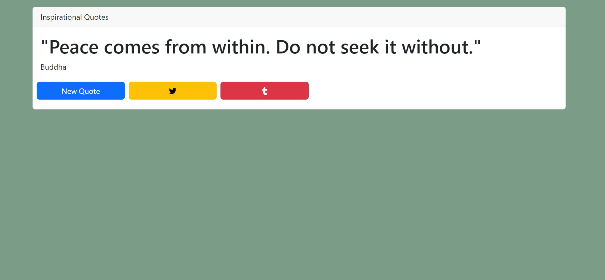
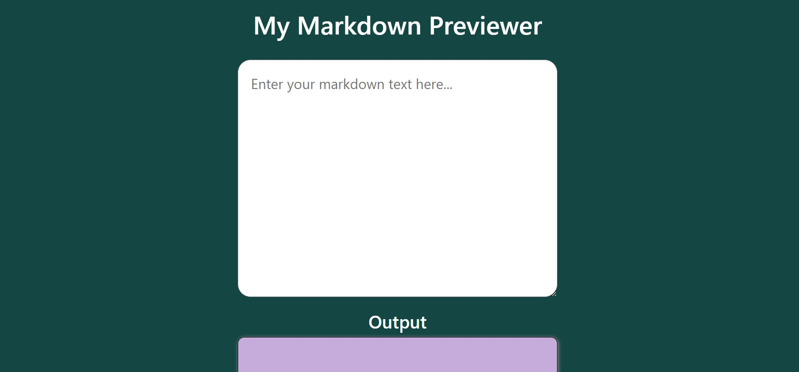
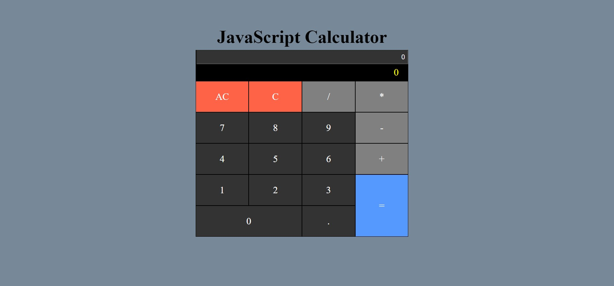
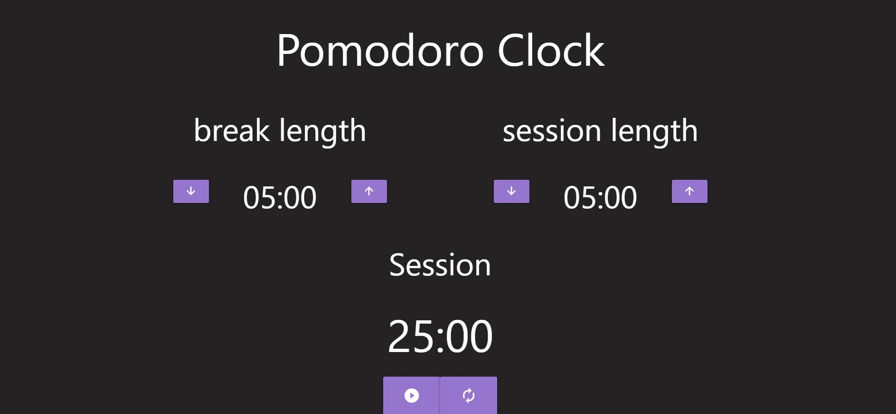

# Front-End-Development-Libraries
 FreeCodeCamp-Front End Development Libraries

 FreeCodeCamp Front End Development Libraries
This repository contains the projects I completed as part of the FreeCodeCamp Front End Development Libraries certification.
These projects cover different aspects of web development, such as responsive design, CSS, JavaScript, and front-end libraries.

Projects Included

Random Quote Machine: A web application that generates random quotes and allows users to tweet them.
[Random Quote Machine] 

(https://aneal07.github.io/Front-End-Development-Libraries/randomQuoteMAchine)

Markdown Previewer: A web application that allows users to preview their Markdown syntax in real-time.
[Markdown-previewer] 

(  https://aneal07.github.io/Front-End-Development-Libraries/Markdown%20Previewer)

Drum Machine: A web application that allows users to play musical sounds by clicking on buttons or using their keyboard.

[Drum Machine]

(https://aneal07.github.io/Front-End-Development-Libraries/Drum%20Machine)

JavaScript Calculator: A web application that allows users to perform basic arithmetic calculations.
[Javascript basic calculator] 

(https://aneal07.github.io/Front-End-Development-Libraries/javaScript%20Calculator)

.

Pomodoro Clock: A web application that helps users manage their time using the Pomodoro technique.
[Pomodoro Clock] 

( https://aneal07.github.io/Front-End-Development-Libraries/25%2B5%20clock)

Technologies Used
These projects were built using a variety of technologies, including:

HTML
CSS
JavaScript
React
Bootstrap

How to Run the Projects
To run these projects, simply download or clone the repository, 
and open the project folder in your preferred text editor. Then, 
open the index.html file in your web browser. Alternatively, 
you can use a development server to run the projects.

Acknowledgments
These projects were completed as part of the FreeCodeCamp Front End Development Libraries certification.
I would like to thank FreeCodeCamp for providing this excellent learning resource, 
as well as the community for their support and feedback.

